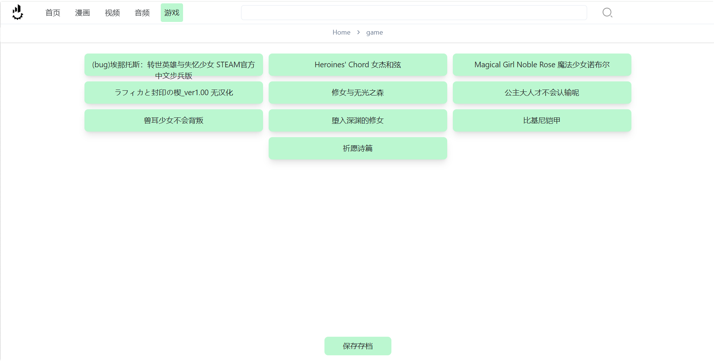
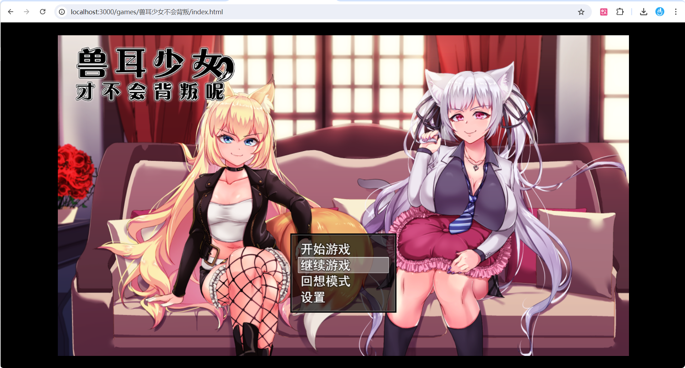
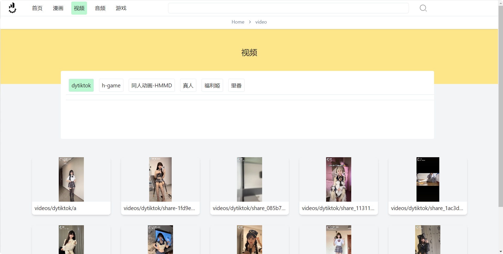

# 启动

> nextjs第一次访问页面编译会比较卡, 请耐心等待

```shell
npm run dev
pnpm dev
```

# 运行演示



# 功能

- 视频
    - ON 视频播放结束, 自动跳转列表下一个视频
    - ON 打开时视频自动播放, 并且全屏
    - OFF 视频数据入数据库(sqlite)
- 图片/漫画
    - ON 漫画自动滚屏(后续希望可以用户自行配置速度, 比如localStorage设置每秒y多少)
    - ON 漫画排序
    - ON 漫画数据入数据库, 且有脚本可以自动读取目录入库(prisma/manga-feed-*)
- 音频
    - OFF 页面美观
    - ON 听音频功能
    - OFF 数据库录入
- 首页
    - OFF 页面完成度
- 游戏
    - ON 点击按钮可将当前游戏的存档缓存到服务器本地
    - ON 进入游戏前根据游戏名读取存档
    - ON 游戏(移动端要能听到声音需要开启桌面版网站选项)
    - OFF 数据库录入

